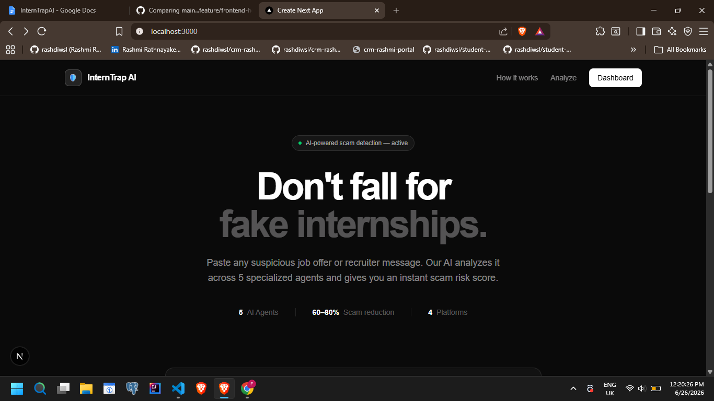
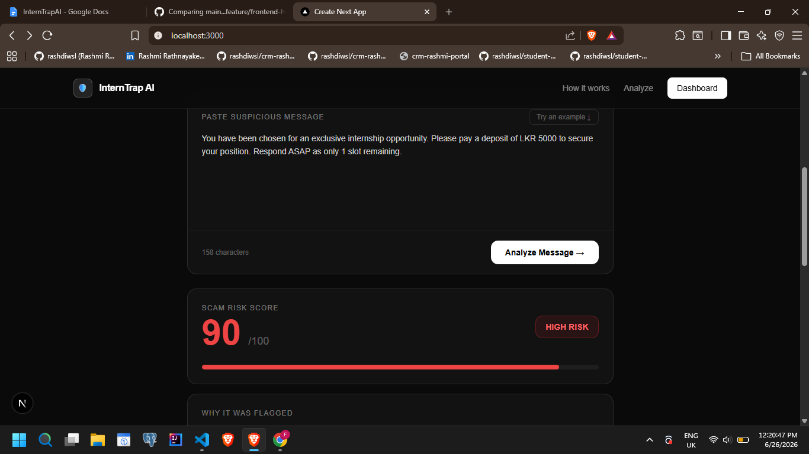
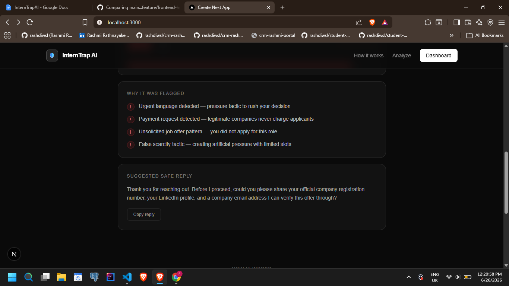
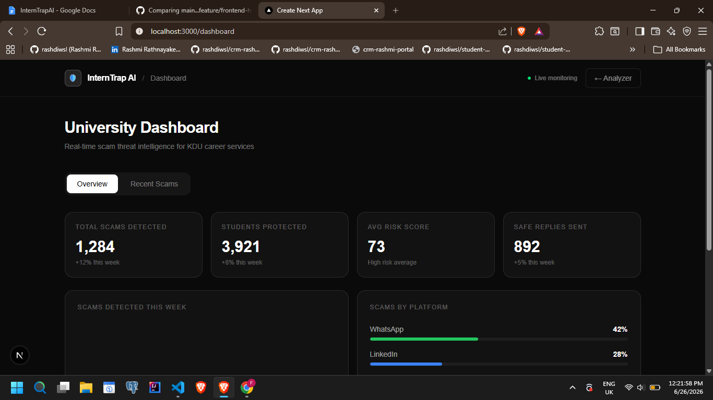

# 🛡️ InternTrap AI
### Scam Detection System for Students - Powered by AI Agents

InternTrap AI is a multi-agent AI system that protects university students from fraudulent internship and job offers. Paste a suspicious message, and InternTrap analyzes it for scam patterns, psychological manipulation tactics, and domain legitimacy, delivering a clear 0–100 risk score in seconds.

---

## 📸 Screenshots


| Page | Preview |
|------|---------|
| Homepage — Message Submission |  |
| Risk Score Dashboard (Animated Gauge) |  |
| Color-Coded Risk Breakdown Panel |  |
| Safe Reply Generator Modal |  |
| University Dashboard — Scam Analytics |  |

---

## 🧠 How It Works

InternTrap runs three AI agents in parallel every time a message is submitted:

**1. Detection Agent**
Reads the suspicious message and asks: *Is this a scam?*
Uses a fine-tuned DistilBERT model trained on thousands of scam messages. Also checks for red-flag keywords, unrealistic salaries, and suspicious links.
→ Output: threat score (0–1)

**2. Psychology Agent**
Reads the same message and asks: *Is this trying to manipulate me emotionally?*
Detects urgency ("respond within 2 hours"), fake authority ("Head of HR at Google"), scarcity ("only 1 position left"), and fear ("your application will be cancelled").
→ Output: list of manipulation tactics + manipulation score

**3. Risk Scorer**
Combines both outputs into one number: **0–100**.
- 0 = totally safe
- 100 = definitely a scam

---

## 🗂️ Project Structure

```
interntrap-ai/
├── frontend/               # Next.js + Tailwind CSS (Member 1)
│   ├── app/
│   │   ├── page.tsx        # Homepage — message submission UI
│   │   └── dashboard/      # University dashboard
│   └── components/
│       ├── RiskGauge.tsx   # Animated 0–100 gauge
│       ├── RiskBreakdown.tsx
│       └── SafeReplyModal.tsx
│
├── backend/                # FastAPI (Member 3)
│   ├── main.py
│   ├── agents/
│   │   ├── detection_agent.py
│   │   ├── psychology_agent.py
│   │   ├── verification_agent.py
│   │   ├── response_agent.py
│   │   └── learning_agent.py
│   ├── orchestrator.py     # LangChain coordination
│   └── database/
│       └── schema.sql
│
├── model/                  # DistilBERT fine-tuning (Member 2)
│   ├── train.ipynb         # Run on Google Colab
│   ├── dataset/
│   └── saved_model/
│
└── deployment/             # CI/CD config (Member 4)
    ├── vercel.json
    └── render.yaml
```

---

## ⚙️ Tech Stack

| Component | Technology |
|-----------|-----------|
| Frontend | React.js + Next.js + Tailwind CSS |
| Backend API | FastAPI (Python) |
| Scam Detection Model | DistilBERT (Hugging Face) |
| Agent Orchestration | LangChain |
| Recruiter & Domain Verification | WHOIS API + VirusTotal API |
| OCR & Screenshot Analysis | EasyOCR / Tesseract OCR |
| Database | PostgreSQL (Supabase) |
| Authentication | Clerk / Supabase Auth |
| Analytics Dashboard | Chart.js / Recharts |
| Frontend Deployment | Vercel |
| Backend Deployment | Render |
| Model Storage | Hugging Face Hub / Supabase Storage |
| Version Control | GitHub |

---

## 👥 Team & Task Division

### Member 1 — Frontend & UX
- Next.js app setup, routing, Tailwind design system
- Message submission UI + animated risk score gauge (0–100)
- Color-coded risk breakdown panel (explainable AI output)
- Safe reply generator modal
- University dashboard page (scam analytics)
- Demo video / pitch slides

### Member 2 — Detection & Psychology Agents
- DistilBERT fine-tuning on scam datasets (PhishTank + custom labeled data)
- Keyword + urgency + salary pattern classifier
- Psychology Agent: urgency / authority / fear / scarcity signal detector
- Risk score aggregation logic
- Unit tests for agent outputs

### Member 3 — Verification & Backend API
- FastAPI app skeleton + REST endpoints
- Verification Agent: WHOIS lookup, VirusTotal API, domain age checker
- LinkedIn profile cross-reference
- LangChain orchestration layer connecting all 5 agents
- PostgreSQL schema + Supabase setup
- Docker containerization

### Member 4 — Response Agent, Learning and Deployment
- Response Agent: context-aware safe reply template generator
- Learning Agent: feedback loop (thumbs up/down → logs → retraining queue)
- Scam dataset curation (500–1,000 labeled examples minimum)
- Deployment: Vercel + Render CI/CD pipeline
- API rate limiting, JWT auth, HTTPS
- Final integration testing + demo prep

---

## 🚀 Getting Started

### Prerequisites
- Node.js 18+
- Python 3.10+
- Git

### Frontend Setup
```bash
cd frontend
npm install
npm run dev
```
Open [http://localhost:3000](http://localhost:3000)

### Backend Setup
```bash
cd backend
python -m venv venv

# Windows
venv\Scripts\activate

# macOS / Linux
source venv/bin/activate

pip install -r requirements.txt
uvicorn main:app --reload
```
API runs at [http://localhost:8000](http://localhost:8000)  
Docs at [http://localhost:8000/docs](http://localhost:8000/docs)

### Environment Variables

Create a `.env` file in `/backend`:
```env
VIRUSTOTAL_API_KEY=your_virustotal_key
WHOIS_API_KEY=your_whois_key
SUPABASE_URL=your_supabase_url
SUPABASE_KEY=your_supabase_key
```

Create a `.env.local` file in `/frontend`:
```env
NEXT_PUBLIC_API_URL=http://localhost:8000
NEXT_PUBLIC_CLERK_PUBLISHABLE_KEY=your_clerk_key
```

---

## 🧪 Testing the API

Use Postman or curl to test before the frontend is connected:

```bash
curl -X POST http://localhost:8000/analyze \
  -H "Content-Type: application/json" \
  -d '{"message": "Congratulations! You have been selected for a remote internship paying $5000/month. Reply within 2 hours to confirm your spot."}'
```

Expected response:
```json
{
  "risk_score": 87,
  "threat_score": 0.82,
  "manipulation_tactics": ["urgency", "unrealistic_salary"],
  "verdict": "HIGH RISK — Likely Scam",
  "safe_reply": "Thank you for reaching out. Could you share the official company website and HR contact details so I can verify this opportunity?"
}
```

---

## 🌿 Git Workflow

We use feature branches — never commit directly to `main`.

```bash
# Start a new feature
git checkout -b feature/your-feature-name

# Push and open a PR
git push origin feature/your-feature-name
```

Branch naming convention:
- `feature/risk-gauge-ui`
- `feature/detection-agent`
- `feature/verification-api`
- `feature/response-agent`

---

## 📦 Model Training (Google Colab)

The DistilBERT model is trained in Google Colab (free GPU).

1. Open `model/train.ipynb` in [Google Colab](https://colab.research.google.com)
2. Run all cells — training takes ~20–30 minutes on a free T4 GPU
3. Download the saved model from `model/saved_model/`
4. Upload to Hugging Face Hub or Supabase Storage
5. Update the model path in `backend/agents/detection_agent.py`

---

## 🚢 Deployment

| Service | Platform | Notes |
|---------|----------|-------|
| Frontend | Vercel | Auto-deploys from `main` branch |
| Backend | Render | Auto-deploys from `main` branch |
| Database | Supabase | Managed PostgreSQL |
| Models | Hugging Face Hub | Version-controlled model storage |

---

## 👥 Contributors

| Member | Role | GitHub |
|--------|------|--------|
| Rashmi Rathnayake | Frontend & UX | [@rashdiwsl](https://github.com/rashdiwsl) |
| Tharushi Rathnasekara | Detection & Psychology Agents | [@tharushi621](https://github.com/tharushi621) |
| Nethmi Amasha | Verification & Backend API | [@NethmiAmasha2002](https://github.com/NethmiAmasha2002) |
| Sasuni Dilrukshi | Response Agent & Deployment | [@Sasuni22](https://github.com/Sasuni22) |

---
